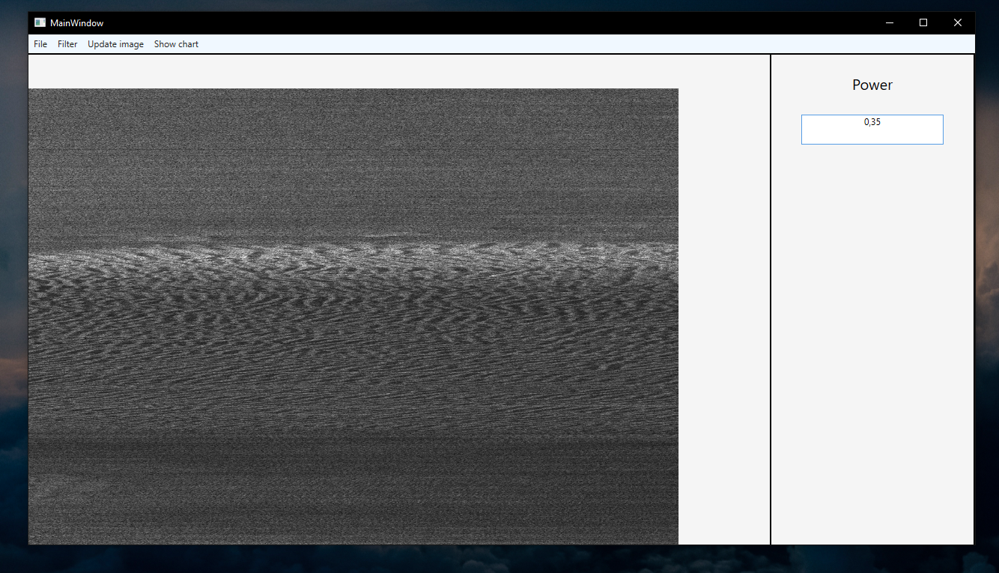

# GeolocationProcessing
 
Тема проекта «Картографирование морского дна с использованием многопоточности». Целью было создание оконного приложения способного быстро восстанавливать и просматривать изображения морского дна по данным, снятым с гидроакустического устройства, а также способного накладывать фильтры с различными коэффициентами. Также целью было при помощи созданного нами приложения провести такие исследования как: оценить скорости работы приложения в зависимости от количества использованных потоков для обработки данных, и оценить влияние коэффициентов фильтров на равномерное распределение оттенков серого относительно эталонного распределения.
Для создания приложения наша команда решила использовать средства языка C#, а именно WPF – это система для построения клиентских приложений. Удалось реализовать: 4 вида фильтрации; многопоточную обработку изображений, для наложения фильтров; просмотр получившегося изображения непосредственно в окне программы; просмотр гистограммы распределения цветов на изображении; сохранение получившегося после обработки изображения; а также Benchmark для тестирования работы приложения при разном количестве потоков.

